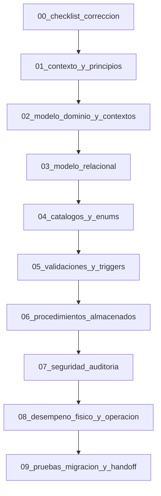

# SDD - Banco MySQL

Este directorio concentra la especificacion tecnica del proyecto bajo una aproximacion Schema-Driven Development (SDD) y DDD aplicada directamente a MySQL.

## Objetivo

Definir el dominio bancario como una base de datos transaccional primero, donde:

- Las entidades del dominio se modelan como tablas.
- Los enums y estados se modelan como tablas catalogo.
- Las reglas basicas de integridad se implementan con triggers.
- Los casos de uso se exponen mediante procedimientos almacenados.
- La auditoria se registra desde la capa de base de datos.

## Alcance y premisas

- El repositorio documenta el diseno de una base de datos bancaria transaccional.
- La logica de escritura sensible debe vivir en procedimientos almacenados o triggers controlados.
- La documentacion debe mantenerse sincronizada con los scripts SQL del paquete `banco_bd/`.
- Las decisiones de seguridad, auditoria y trazabilidad forman parte del diseno, no son complementos opcionales.
- Fuera de alcance quedan dominios no bancarios o soluciones que dependan de almacenamiento externo para la integridad principal.

## Documento origen

- [Enunciado Banco.md](../Enunciado%20Banco.md)

## Estructura documental

0. [00_checklist_correccion.md](00_checklist_correccion.md)
1. [01_contexto_y_principios.md](01_contexto_y_principios.md)
2. [02_modelo_dominio_y_contextos.md](02_modelo_dominio_y_contextos.md)
3. [03_modelo_relacional.md](03_modelo_relacional.md)
4. [04_catalogos_y_enums.md](04_catalogos_y_enums.md)
5. [05_validaciones_y_triggers.md](05_validaciones_y_triggers.md)
6. [06_procedimientos_almacenados.md](06_procedimientos_almacenados.md)
7. [07_seguridad_auditoria.md](07_seguridad_auditoria.md)
8. [08_desempeno_fisico_y_operacion.md](08_desempeno_fisico_y_operacion.md)
9. [09_pruebas_migracion_y_handoff.md](09_pruebas_migracion_y_handoff.md)
10. [10_alineacion_madurez_tecnica.md](10_alineacion_madurez_tecnica.md)

## Criterios de diseño

- MySQL 8.x como motor objetivo.
- InnoDB para consistencia transaccional.
- utf8mb4 para soporte completo de texto.
- Nombres en snake_case.
- Claves primarias numéricas internas y llaves naturales unicas donde aplique.
- Estados y tipos siempre catalogados.
- Escritura de negocio solo a traves de SPs.
- Cambios criticos de estado solo dentro de transacciones.
- Auditoria obligatoria para operaciones financieras y de aprobacion.

## Resultado esperado

El contenido de esta carpeta debe ser suficiente para que agentes de IA posteriores puedan generar y validar:

- el modelo de dominio bancario,
- el modelo relacional completo,
- los catalogos y enums,
- los triggers de validacion,
- los procedimientos almacenados,
- la estrategia de seguridad y auditoria,
- el plan de pruebas, migracion y handoff,
- y la guia operativa que acompana la ejecucion de los scripts SQL.

